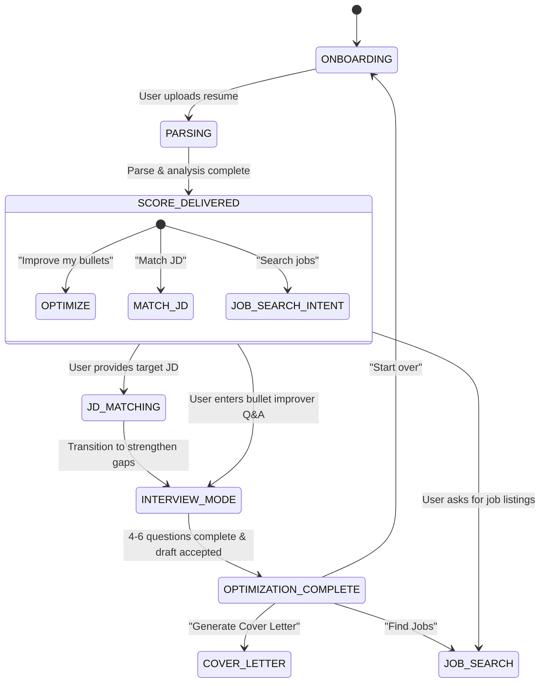

# ResFlow 🚀

> **AI-Powered Career Intelligence & Resume Optimization Platform**

 ResFlow is a premium AI career intelligence platform powered by Express, MongoDB, and Google Gemini. It parses resumes with technical accuracy, scores resumes across 5-dimensional metrics, performs gap analyses against targeted Job Descriptions (JDs), and runs a conversation-driven career coach state machine.

---

## 🏛️ System Architecture

```
┌─────────────────────────────────────────────────┐
│                   React Frontend                 │
│  (Conversation UI, Resume Upload, Score Cards)   │
└────────────────────┬────────────────────────────┘
                     │ REST API
┌────────────────────▼────────────────────────────┐
│              Express.js Backend                  │
│  ┌──────────┐ ┌──────────┐ ┌──────────────────┐ │
│  │ Auth     │ │ Resume   │ │ AI Engine        │ │
│  │ (JWT)    │ │ Parser   │ │ (Gemini API)     │ │
│  └──────────┘ └──────────┘ └──────────────────┘ │
│  ┌──────────┐ ┌──────────┐ ┌──────────────────┐ │
│  │ Job API  │ │ RAG      │ │ Cover Letter     │ │
│  │ Aggreg.  │ │ Pipeline │ │ Generator        │ │
│  └──────────┘ └──────────┘ └──────────────────┘ │
└──┬──────────────┬───────────────┬───────────────┘
   │              │               │
   ▼              ▼               ▼
MongoDB        pgvector         S3/Local
(Users,        (Embeddings,     (Resume
 Sessions,      JD vectors)      Files)
 Resumes)
```

---

## 💬 Conversation State Machine

AntiGravity uses a high-fidelity finite state machine to manage the AI coaching conversational session.



---

## 🛠️ Tech Stack & Key Libraries

- **Runtime**: Node.js & Express.js
- **Database**: MongoDB (via Mongoose)
- **AI Engine**: Google Gemini API SDK (`@google/generative-ai`)
- **PDF Extraction**: `pdf-parse`
- **File Uploads**: Multer
- **Auth**: JWT Authentication & Cryptographic password hashing (Bcrypt)
- **Validation**: Joi (Robust schema checking)

---

## ⚙️ Environment Configuration

Create a `.env` file in the root directory based on `.env.example`:

```bash
# Server
PORT=5000
NODE_ENV=development

# MongoDB
MONGODB_URI=mongodb://localhost:27017/resflow

# JWT Authentication
JWT_SECRET=your-super-secret-jwt-key

# Google Gemini
GEMINI_API_KEY=your-gemini-api-key
GEMINI_MODEL=gemini-1.5-flash
MAX_TOKENS=8192

# Optional integrations
ENABLE_LIVE_JOBS=false
ENABLE_COVER_LETTER=true
```

---

## 📡 API Endpoints

### 🔐 Authentication

| Method | Endpoint | Description | Auth | Validation |
|--------|----------|-------------|------|------------|
| `POST` | `/api/auth/register` | Register new candidate profile | No | Name, Email, Password |
| `POST` | `/api/auth/login` | Login, issue JWT credentials | No | Email, Password |
| `GET` | `/api/auth/me` | Fetch active user credentials | Yes | Header: JWT Token |

### 📄 Resume Management

| Method | Endpoint | Description | Auth | Format |
|--------|----------|-------------|------|--------|
| `POST` | `/api/resume/upload` | Upload PDF/DOCX file and parse/score | Yes | Multipart form-data |
| `POST` | `/api/resume/parse-text` | Paste raw text and parse/score | Yes | JSON body |
| `GET` | `/api/resume` | List all uploaded resume profiles | Yes | - |
| `GET` | `/api/resume/:id` | Fetch fully parsed resume data model | Yes | - |
| `GET` | `/api/resume/:id/score` | Fetch ATS & Recruiter 5-dimension scorecard | Yes | - |

### 💬 Conversational Career Coach (AI Session)

| Method | Endpoint | Description | Auth | Body |
|--------|----------|-------------|------|------|
| `POST` | `/api/chat/session/new` | Instantiate fresh coaching session | Yes | `{ resumeId }` |
| `GET` | `/api/chat/session/active` | Retrieve or create active conversation session | Yes | - |
| `GET` | `/api/chat/session/:id` | Get conversation message history | Yes | - |
| `POST` | `/api/chat/message` | Send message to AI and trigger transitions | Yes | `{ message, sessionId }` |

### 💼 JD Matching & Jobs

| Method | Endpoint | Description | Auth | Body/Query |
|--------|----------|-------------|------|------------|
| `POST` | `/api/jobs/match` | Match resume to Job Description gap analysis | Yes | `{ resumeId, jobDescription }` |
| `GET` | `/api/jobs/search` | Search live jobs and AI profile recommendations | Yes | `?query=...&location=...` |

### 📝 Cover Letters

| Method | Endpoint | Description | Auth | Body |
|--------|----------|-------------|------|------|
| `POST` | `/api/cover-letter/generate` | Generate cover letters tailored by tone | Yes | `{ resumeId, jobDescription, companyName, tone }` |

---

## 🚀 Getting Started

### 1. Install dependencies
```bash
npm install
```

### 2. Startup development server
```bash
npm run dev
```

### 3. Test API Health
```bash
curl http://localhost:5000/health
```
